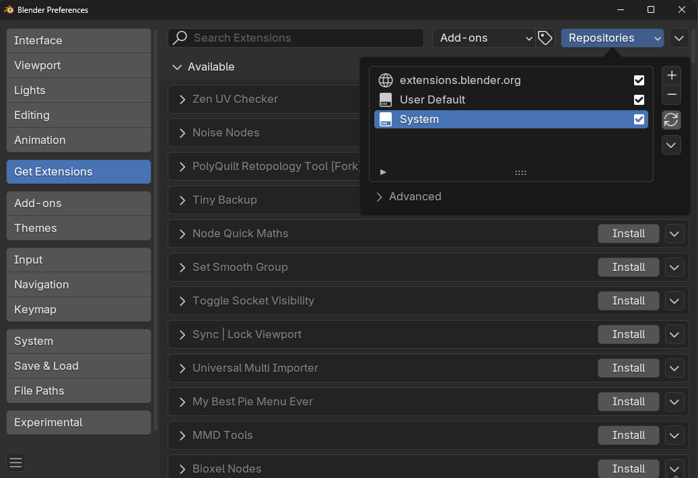
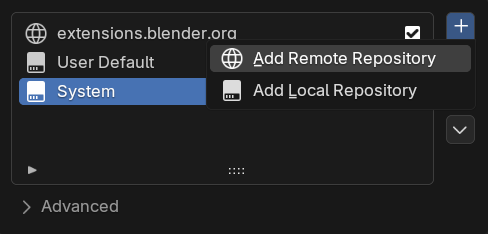

<h1 align="center">
    
</h1>

# polygoniq extensions repository

Welcome to polygoniq extensions repository, we host all of our free Blender extensions here.

## About

> [!NOTE]
> More information about our individual extensions, such as the licensing information, can be found within their respective repositories. If you encounter any issues with our extensions, please submit an issue in the relevant repository.

| Addon  | Issue Tracker |
| ------------- | ------------- |
| [engon](https://github.com/polygoniq/engon) | [Submit Issue](https://github.com/polygoniq/engon/issues)  |
| [blend1](https://github.com/polygoniq/blend1)  | [Submit Issue](https://github.com/polygoniq/blend1/issues)  |
| [open_linked](https://github.com/polygoniq/open_linked)  | [Submit Issue](https://github.com/polygoniq/open_linked/issues)  |
| [blenderkitty](https://github.com/polygoniq/blenderkitty)  | You can't have issues with `blenderkitty`.  |

> [!TIP]
> You can support development of our free extensions by purchasing some of our paid products on [BlenderMarket](https://blendermarket.com/creators/polygoniq?ref=673) or [Gumroad](https://polygoniq.gumroad.com/).

## Repository Setup

By setting up a remote repository you can install and update our free extensions directly within Blender.

> [!NOTE]
> Blender version **4.2 or above is required**. Previous versions don't support extensions and remote repositories. Get the latest Blender from [blender.org](https://www.blender.org/download/).

> [!CAUTION]
> Remove all previous installation of our addons before continuing. When our legacy addons and extensions are present at the same time, we cannot guarantee correct functionality.

&#8291;**1.** Open `Preferences` and navigate to the `Get Extensions` section and click `Repositories` in the top right corner.

&#8291;**2.** Inside `Repositories` click the `+` button and select `Add Remote Repository`.

&#8291;**3.** Copy `https://extensions.polygoniq.com/api/v1/extensions` into the `URL` and click `Create`.

&#8291;**4.** This will create `polygoniq.extensions.com` extensions repository and you should see a list of available `polygoniq` extensions in the extension list. If you have the official blender extensions repository enabled, our extensions will appear after it (at bottom of the list). You can always toggle what's visible in the `Repositories` popover.

